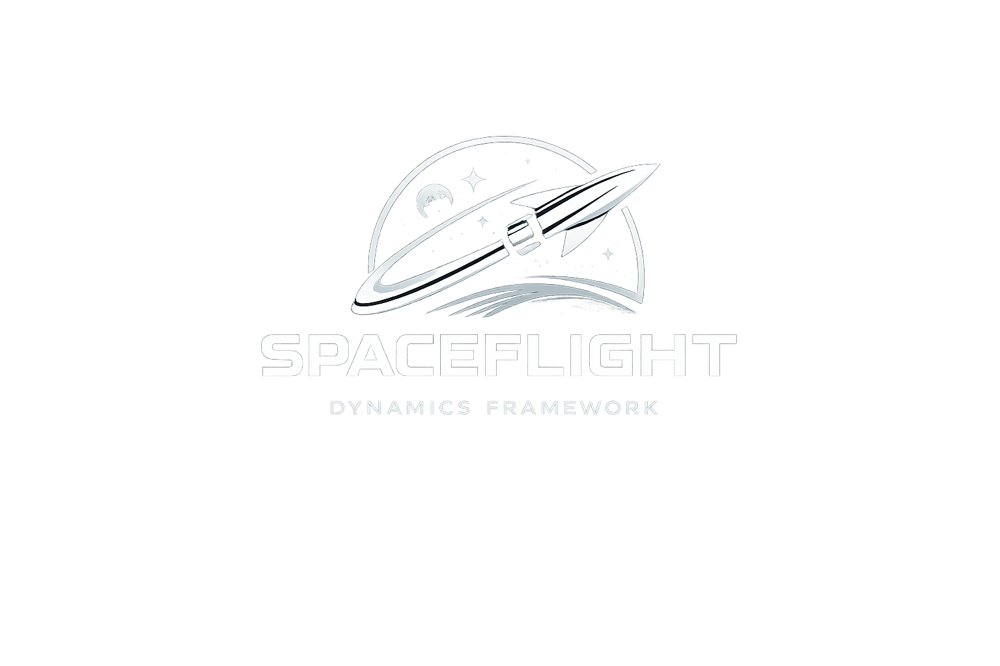
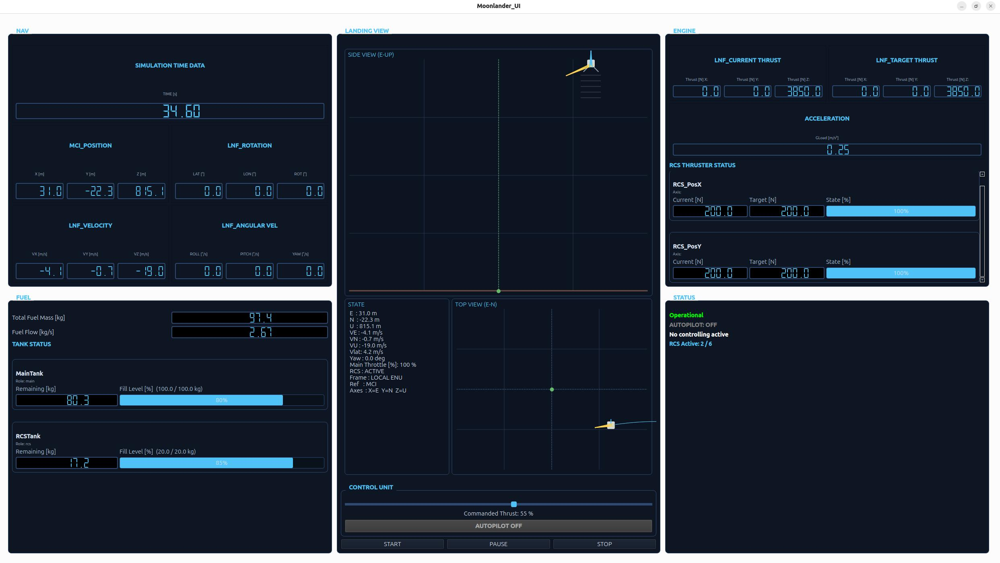
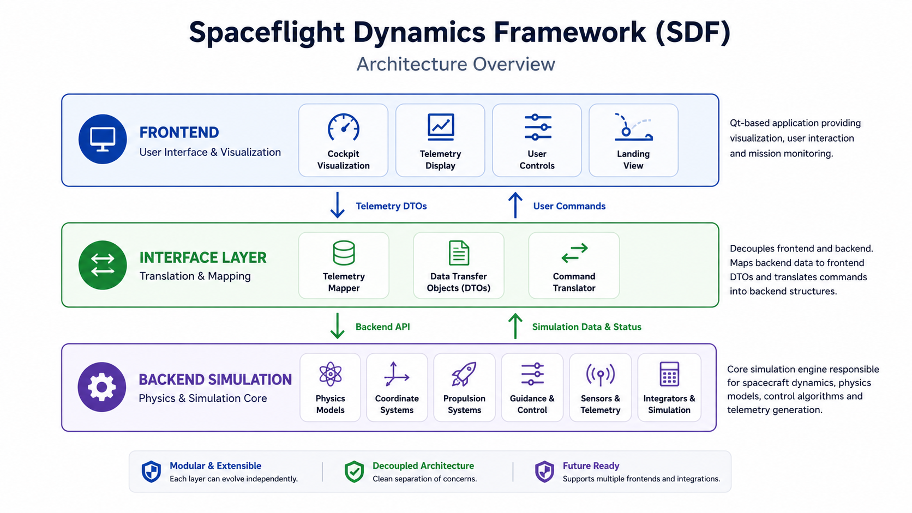
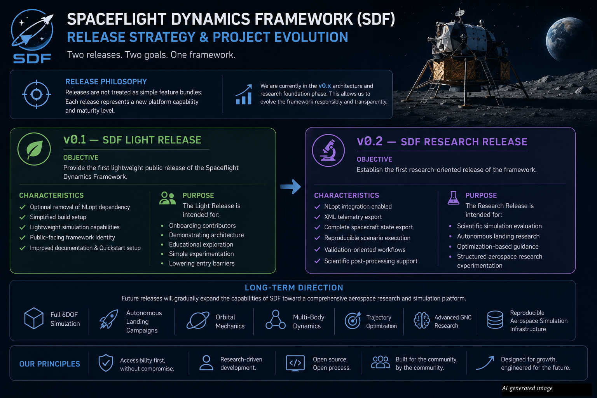

# Spaceflight Dynamics Framework (SDF)

<p align="center">
  
</p>

<p align="center">
<b>An open-source C++ framework for spacecraft simulation, guidance, navigation and control.</b>
</p>

<p align="center">
Modern • Modular • Extensible • Research-Oriented
</p>

---------------------------------------------------------------------------------------

## 🚀 What is SDF?

The **Spaceflight Dynamics Framework (SDF)** is an open-source C++
framework for developing modular aerospace simulation software.

Rather than focusing on a single simulation, SDF provides reusable
building blocks for spacecraft dynamics, guidance, navigation, control,
propulsion, telemetry and visualization.

Its mission is to provide a platform where aerospace enthusiasts,
students, researchers and developers can learn, experiment and develop
modern aerospace software while following clean software engineering
principles.

SDF is **not just a simulation**. It is intended to become an extensible
platform for education, experimentation and scientific research in
spacecraft dynamics and aerospace software engineering.

------------------------------------------------------------------------

## 🌙 Demonstration Application

The repository currently contains a demonstration application showcasing
the capabilities of the framework through an autonomous lunar landing
scenario.

Future applications can reuse the same framework architecture while
targeting completely different spacecraft missions and simulation
scenarios.

<p align="center">
  
</p>

<p align="center">
  <i>Current SDF demonstration application</i>
</p>

------------------------------------------------------------------------

## ✨ Framework Highlights

-   Modular simulation backend
-   Dedicated interface layer
-   Frontend / backend decoupling
-   Telemetry Mapper
-   Telemetry DTOs
-   Eigen-based mathematics
-   JSON spacecraft configuration
-   Adaptive descent controller
-   Multi-engine propulsion system
-   Individual RCS thruster simulation
-   Qt cockpit application

------------------------------------------------------------------------

## 🏗 Architecture

<p align="center">
  
</p>

<p align="center">
  <i>SDF layered architecture overview</i>
</p>

Further documentation:

https://www.aerospace-simulation.dev/simulation/architecture/

------------------------------------------------------------------------

## 🔬 Scientific Vision

SDF is intended to become an experimental environment for aerospace
research.

Research topics include:

-   optimal control
-   GNC
-   adaptive controllers
-   numerical integration
-   simulation stability
-   spacecraft dynamics
-   optimization
-   telemetry analysis
-   controller benchmarking

------------------------------------------------------------------------

## 🚧 Roadmap

The Spaceflight Dynamics Framework follows an incremental development strategy. Each release expands the framework while maintaining a stable architectural foundation.

<p align="center">
  
</p>

<p align="center">
  <i>SDF development roadmap and release strategy</i>
</p>

The long-term vision is to evolve SDF into a reusable aerospace simulation platform supporting:

- 6-DOF spacecraft dynamics
- orbital mechanics
- ROS2 integration
- replay & telemetry analysis
- controller benchmarking
- planetary mission scenarios

------------------------------------------------------------------------

## ⚙️ Quick Start

See the installation guides in the docs folder.

``` bash
git clone https://github.com/gerd-lrt-dev/spaceflight-dynamics-framework.git
cd spaceflight-dynamics-framework
mkdir build
cd build
cmake ..
cmake --build .
```

------------------------------------------------------------------------

## 📚 Documentation

Comprehensive documentation is available on the project website.

### 🌐 Project Website

https://www.aerospace-simulation.dev

---

### 🏗 Architecture

Framework architecture and software design.

https://www.aerospace-simulation.dev/simulation/architecture/

---

### 🎮 Demonstration

Overview of the current demonstration application.

https://www.aerospace-simulation.dev/simulation/demo/

---

### 🧮 Mathematics

Physics & Motion

https://www.aerospace-simulation.dev/mathematics/physics/

Coordinate Frames & Transformations

https://www.aerospace-simulation.dev/mathematics/coordinateTransformation/

Main Engine Model

https://www.aerospace-simulation.dev/mathematics/thrust/

Reaction Control System

https://www.aerospace-simulation.dev/mathematics/RCSBasicModel/

Adaptive Descent Controller

https://www.aerospace-simulation.dev/mathematics/adaptiveDescentController/

Impact & Structural Integrity

https://www.aerospace-simulation.dev/mathematics/impact/

---

### 👥 Team

Meet the people behind the project.

https://www.aerospace-simulation.dev/team/

------------------------------------------------------------------------

## 🤝 Contributing

Whether you're an experienced aerospace engineer, a software developer, a researcher, a student or simply curious about spacecraft simulation — contributions are always welcome.

SDF is an interdisciplinary project, and contributing means much more than writing code. There are many ways to get involved:

- develop new simulation models
- validate existing physical models
- improve numerical methods
- design and evaluate control algorithms
- test and benchmark new features
- improve existing software components
- enhance the user interface
- extend the documentation
- discuss ideas, report bugs and suggest improvements

If you would like to contribute, please have a look at:

- CONTRIBUTING.md
- Installation Guidelines

Every contribution—whether it is code, validation, documentation, testing or engineering expertise—helps make SDF a better platform for learning, experimentation and aerospace research.

We'd be happy to have you onboard.

------------------------------------------------------------------------

## 📜 License

This project is released as open-source software.

See the `LICENSE` file for licensing information.

---

If you are interested in spacecraft simulation, aerospace software engineering or simply want to learn something new, you're invited to join the journey.
