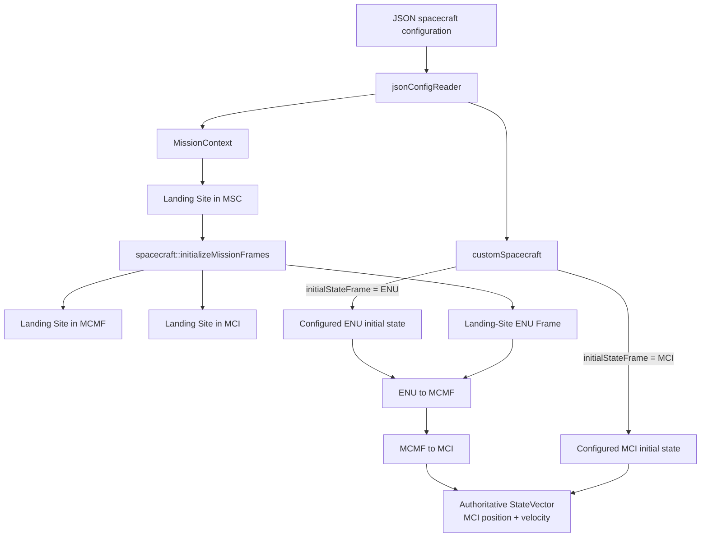
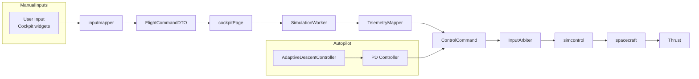
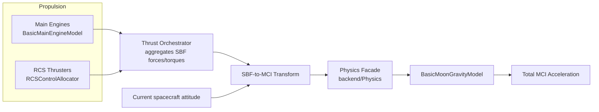
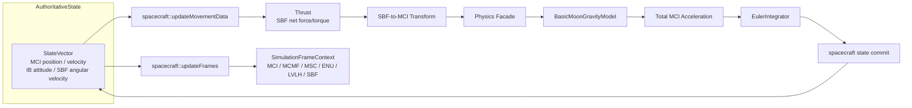
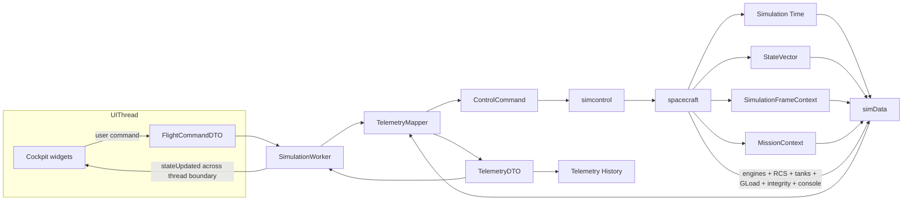
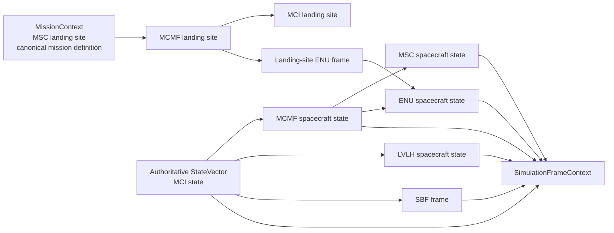
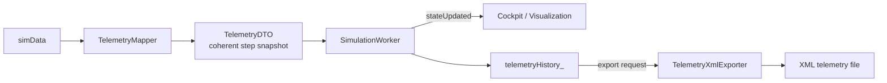

# SDF Core Data Flow Documentation

This document describes the most important data flows inside the **Spaceflight Dynamics Framework (SDF)**.
It is intended as architectural reference material for future contributors and to support future refactoring and verification activities.

The diagrams below focus on **architectural data flow and ownership** on the current `main` branch. They cover initialization, runtime execution, frontend/backend communication, simulation lifecycle, frame derivation, and telemetry recording/export.

A central architectural rule is that the configured spacecraft state may be expressed in different input frames, while the propagated runtime state is resolved once into **Moon-Centered Inertial (MCI)** coordinates and remains authoritative there.

```text
Configuration
        ↓
Initial-State Resolution
        ↓
Authoritative MCI StateVector
        ↓
Physics / Integration
        ↓
Derived Frame Context
        ↓
simData
        ↓
TelemetryMapper
        ↓
TelemetryDTO
        ├─→ Cockpit / Visualization
        └─→ Telemetry History / XML Export
```

The runtime control backbone is:

```text
Manual Frontend Input
        ↓
FlightCommandDTO
        ↓
SimulationWorker / TelemetryMapper
        ↓
ControlCommand
        ↓
InputArbiter
        ← Autopilot (spacecraft state → AdaptiveDescentController → PD → ControlCommand)
        ↓
Actuation / Propulsion
        ↓
SBF Forces + Torques
        ↓
Current-Attitude SBF-to-MCI Transform
        ↓
Physics Facade (physics::computeAcc)
        ↓
BasicMoonGravityModel
        ↓
Total MCI Acceleration
        ↓
Numerical Integration (EulerIntegrator)
        ↓
Authoritative StateVector
        ↓
SimulationFrameContext
        ↓
simData
        ↓
TelemetryMapper
        ↓
TelemetryDTO
        ↓
Qt Thread Boundary
        ↓
Cockpit / Visualization
```

---

## Table of Contents

1. [Configuration to Authoritative Runtime State](#diagram-0-configuration-to-authoritative-runtime-state)
2. [Control Input to Applied Forces](#diagram-1-control-input-to-applied-forces)
3. [Force Generation to Physics Calculation](#diagram-2-force-generation-to-physics-calculation)
4. [Physics Calculation to State Propagation](#diagram-3-physics-calculation-to-state-propagation)
5. [Frontend ↔ Backend Communication](#diagram-4-frontend--backend-communication)
6. [Simulation Lifecycle](#diagram-5-simulation-lifecycle)
7. [Mission and Runtime Frame Context](#diagram-6-mission-and-runtime-frame-context)
8. [Telemetry Recording and XML Export](#diagram-7-telemetry-recording-and-xml-export)
9. [Subsystem Responsibilities](#subsystem-responsibilities)
10. [State Ownership Summary](#state-ownership-summary)

---

## Diagram 0: Configuration to Authoritative Runtime State

D31 introduced landing-site-relative spacecraft initialization while preserving direct MCI initialization.

The configuration therefore describes **how the initial state is expressed**, not which frame the physics engine propagates.

Supported initial-state modes are:

- `positionFrame = "ENU"` together with `velocityFrame = "ENU"`
- `positionFrame = "MCI"` together with `velocityFrame = "MCI"`

Mixed position/velocity frame combinations are rejected by `jsonConfigReader`.



### Initialization ownership

- **`jsonConfigReader`** parses the configured initial-state representation and validates that position and velocity use the same supported frame.
- **`customSpacecraft`** owns spacecraft-specific configuration, including the selected initial-state frame and configured ENU or MCI state.
- **`MissionContext`** owns persistent mission references. The landing site is configured canonically in MSC and resolved during initialization into MCMF, MCI, and ENU representations.
- **`spacecraft::setDefaultValues()`** performs one-time initial-state resolution.
- **`StateVector::MCI_Position` / `StateVector::MCI_Velocity`** become authoritative once initialization is complete.

### ENU initialization

```text
Landing Site MSC
        ↓
MCMF landing-site state
        ↓
Landing-site ENU frame
        ↓
Configured ENU spacecraft state
        ↓
ENU → MCMF
        ↓
MCMF → MCI
        ↓
StateVector
```

ENU is therefore an **input and mission/navigation representation**, not the physics integration frame.

For direct MCI initialization, the configured MCI position and velocity are assigned directly to the runtime state.

---

## Diagram 1: Control Input to Applied Forces

The concrete manual runtime path is:

`inputmapper → FlightCommandDTO → cockpitPage → SimulationWorker → TelemetryMapper → ControlCommand → InputArbiter → simcontrol → spacecraft → Thrust`



### Ownership & responsibilities

- **User input / autopilot** owns intent.
- **`inputmapper`** translates raw UI input into `FlightCommandDTO`.
- **`cockpitPage`** forwards the DTO to the worker thread.
- **`SimulationWorker`** owns the simulation thread boundary and step loop.
- **`TelemetryMapper`** converts frontend command DTOs to backend `ControlCommand` objects.
- **`InputArbiter`** selects/combines manual and automated commands.
- **`simcontrol`** orchestrates the backend simulation step.
- **`Thrust`** converts actuator commands into forces and torques.

The manual and autopilot paths remain separate until `InputArbiter`.

### Per-step command timing

Commands are transferred **before** the backend simulation advances. The current worker order is:

```text
sendControlCommands()
        ↓
runStepSimulation(dt)
        ↓
getQTTelemetryData()
        ↓
append telemetry history
        ↓
emit stateUpdated(...)
```

This ordering prevents a one-step delay between frontend command input and backend actuation.

---

## Diagram 2: Force Generation to Physics Calculation



### Force sources and acceleration calculation

- Main engines and RCS produce force/torque in SBF.
- `Thrust` aggregates the net SBF force and torque.
- The net SBF thrust vector is transformed into MCI using the **current spacecraft attitude**, not a static initialization frame.
- `physics::computeAcc()` calls the configured translational physics model and combines gravity with thrust/mass to obtain total MCI acceleration.
- Controller output is an actuation command, not an additional physical force source.

Generic vector transforms remain pure frame rotations where appropriate; rotating-frame state-derivative effects are a separate concern.

---

## Diagram 3: Physics Calculation to State Propagation

The authoritative translational state is propagated in MCI. `spacecraft::updateMovementData()` coordinates physics/integration and commits the updated state before frame derivation.



### State ownership and update order

1. `spacecraft::updateMovementData()` reads the current authoritative state.
2. `Thrust` aggregates net SBF force/torque.
3. Current attitude transforms SBF thrust into MCI.
4. Translational and rotational physics compute accelerations.
5. `EulerIntegrator` advances individual state components.
6. `spacecraft` commits velocity, position, angular velocity, and attitude to `StateVector`.
7. `spacecraft::updateFrames(time)` reconstructs MCMF, MSC, ENU, LVLH, and SBF representations from the **updated** state.

`SimulationFrameContext` is therefore a coherent derived snapshot of the current authoritative state and is not independently integrated.

Only `EulerIntegrator` is currently implemented.

---

## Diagram 4: Frontend ↔ Backend Communication

The concrete boundary is the Qt signal/slot mechanism between the UI thread and `SimulationWorker` in the simulation thread.



### Downlink flow: UI → Backend

- Cockpit actions produce `FlightCommandDTO` objects.
- `SimulationWorker` receives frontend DTOs on the simulation thread.
- `TelemetryMapper` converts them into backend `ControlCommand` objects.
- Commands flow through `InputArbiter → simcontrol → spacecraft → propulsion`.

### Uplink flow: Backend → UI

At the end of each completed simulation step:

- `spacecraft` exposes the authoritative simulation time and aggregates `StateVector`, `SimulationFrameContext`, `MissionContext`, propulsion, tanks, G-load, integrity, and console output into `simData`.
- `TelemetryMapper` maps that snapshot into `TelemetryDTO`.
- `TelemetryDTO::time` is sourced from backend simulation time; the worker no longer maintains an independent frontend simulation clock.
- Mission and frame context are mapped through the same telemetry boundary.
- `SimulationWorker` stores the snapshot in telemetry history and emits `stateUpdated(TelemetryDTO)`.
- `cockpitPage::onStateUpdated` refreshes the UI.

### Authoritative simulation time

```text
spacecraft::time
        ↓
simData::time
        ↓
TelemetryMapper
        ↓
TelemetryDTO::time
        ↓
Cockpit / Export
```

The same backend time that drives time-dependent frame derivation is therefore also the time exposed through telemetry.

### Thread ownership

- UI widgets/state belong to the UI thread.
- `SimulationWorker`, `TelemetryMapper`, `simcontrol`, `spacecraft`, and backend simulation state belong to the simulation thread.
- DTOs are value objects passed across the thread boundary and contain no shared mutable backend state.

---

## Diagram 5: Simulation Lifecycle

The lifecycle distinguishes **initial start**, **pause/resume**, and **stop/reset**. A resumed simulation must not be reinitialized.

```mermaid
flowchart TD
    CFG[Configuration available]
    START[Start requested]
    INITQ{initialized?}
    HISTQ{old telemetry history exists?}
    CONF[Request overwrite confirmation]
    CLEAR[Clear old history]
    INIT[TelemetryMapper::initialize<br/>simcontrol::initialize<br/>spacecraft construction]
    RUN[Start QTimer / running = true]
    STEP[stepSimulation]
    PAUSE[Pause requested]
    HOLD[Stop QTimer<br/>preserve backend state]
    RESUME[Start requested again]
    STOP[Stop requested]
    RESET[Stop QTimer<br/>emit Telemetry{}<br/>backend reset<br/>initialized = false]

    CFG --> START
    START --> INITQ
    INITQ -->|false| HISTQ
    HISTQ -->|yes| CONF
    CONF --> CLEAR
    HISTQ -->|no| INIT
    CLEAR --> INIT
    INIT --> RUN
    INITQ -->|true| RUN
    RUN --> STEP

    STEP --> PAUSE
    PAUSE --> HOLD
    HOLD --> RESUME
    RESUME --> INITQ

    STEP --> STOP
    HOLD --> STOP
    STOP --> RESET
```

### Lifecycle semantics

1. **Configuration loading**: `ConfigManager → MainWindow → SimulationWorker` supplies the JSON configuration.
2. **Initial start**: if no simulation session is initialized, `TelemetryMapper::initialize → simcontrol::initialize` creates the backend simulation and resolves the initial state.
3. **History protection**: if an earlier stopped run left telemetry history in the worker, starting a new session requests overwrite confirmation before that history is cleared.
4. **Run loop**: a 50 ms `QTimer` drives a fixed `dt = 0.05 s` backend step.
5. **Pause**: `SimulationWorker::pause()` stops the timer only. The backend state, simulation time, fuel state, attitude, and all other simulation state remain unchanged.
6. **Resume**: a subsequent start sees `initialized == true`, skips backend initialization, and continues the existing simulation session.
7. **Stop**: the worker stops the timer, emits an empty telemetry DTO to reset the UI, requests the backend reset, and sets `initialized = false`.
8. **Restart after stop**: the next confirmed start creates a new simulation session from configuration.

Pause therefore means **freeze and resume**, while stop means **terminate/reset the current simulation session**.

---

## Diagram 6: Mission and Runtime Frame Context

SDF distinguishes persistent **mission reference data** from **spacecraft runtime frame representations**.



### `MissionContext`

`MissionContext` stores stable mission references independent of the current spacecraft state.

For the current landing implementation:

- `MSC_LandingSite` is the canonical configured landing-site definition.
- `MCMF_landingSite` is derived during initialization.
- `MCI_landingSite` is derived during initialization for inertial consumers.
- `ENU_landingSite` defines the local landing-site frame used for landing-relative navigation and telemetry.

These are mission references, not propagated spacecraft state.

### `SimulationFrameContext`

`SimulationFrameContext` stores the current spacecraft state represented in multiple frames:

- MCI
- MCMF
- MSC
- ENU
- LVLH
- SBF frame definition

The context is reconstructed from the current `StateVector` by `spacecraft::updateFrames()` **after the current step state has been committed**.

No `SimulationFrameContext` representation is independently integrated by the physics engine.

---

## Diagram 7: Telemetry Recording and XML Export

Scientific telemetry export reuses the same `TelemetryDTO` snapshots consumed by the frontend. Recording is owned by `SimulationWorker`; XML serialization is delegated to `TelemetryXmlExporter`.



### Recording semantics

- One telemetry snapshot is collected after each completed backend simulation step.
- The history therefore uses the same simulation time, navigation state, frame context, mission context, propulsion data, integrity, and sensors exposed to other telemetry consumers.
- Pause does not create additional simulation snapshots because no backend steps occur while the timer is stopped.
- Stop terminates the active session but does not silently overwrite an existing history buffer.
- Starting a new simulation with existing history requires explicit overwrite confirmation before clearing the recorded data.
- `TelemetryXmlExporter` is responsible for serialization only; it does not own or generate simulation state.

This preserves a single telemetry contract for UI visualization and scientific export.

---

## Subsystem Responsibilities

| Subsystem | Primary Responsibility | Owns State? | Thread |
|---|---|---|---|
| `ui/` (Cockpit / widgets) | Render telemetry, capture user input | Yes — UI state | UI thread |
| `interface/` (DTOs / Mapper) | Translate between frontend and backend representations | No — contracts / translation | Simulation thread |
| `SimulationWorker` | Own simulation session lifecycle, step timer, telemetry history, DTO transport, export requests | Yes — worker/session state and telemetry history | Simulation thread |
| `TelemetryXmlExporter` | Serialize recorded telemetry history to XML | No — serialization only | Simulation thread / caller context |
| `jsonConfigReader` | Parse spacecraft/mission configuration and validate initial-state frame selection | No — parser | During initialization |
| `customSpacecraft` | Hold spacecraft configuration and configured initial-state representation | Yes — configuration data | Simulation thread |
| `MissionContext` | Hold persistent mission references | Yes — mission reference data | Simulation thread |
| `simcontrol` | Orchestrate backend initialization and each simulation step | No — orchestration logic | Simulation thread |
| `spacecraft` | Hold authoritative state, simulation time, resolve initial state, derive runtime frame representations | Yes — simulation state | Simulation thread |
| `StateVector` | Authoritative propagated spacecraft state | Yes — owned by `spacecraft` | Simulation thread |
| `SimulationFrameContext` | Hold frame representations derived from authoritative state | Derived state only | Simulation thread |
| `CoordinateTransformer` | Transform between MCI, MCMF, MSC, ENU, LVLH, and SBF representations | No — computation only | Simulation thread |
| `backend/Physics` | Compute accelerations from forces/torques | No — computation only | Simulation thread |
| `BasicMoonGravityModel` | Compute translational gravitational acceleration | No — physics model | Simulation thread |
| `backend/Integrators/EulerIntegrator` | Advance individual state components | No — computation only | Simulation thread |
| `backend/Control` / `Controller` / `InputArbiter` | Route/select commands and create actuator requests | No — control logic | Simulation thread |
| `backend/Thrust` | Convert actuator commands into forces/torques and expose propulsion telemetry | No — propulsion model | Simulation thread |

---

## State Ownership Summary

- **Configured initial state** is owned by `customSpacecraft` and may be expressed in ENU relative to the landing site or directly in MCI.
- **Mission reference data** is owned by `MissionContext`.
- **Authoritative runtime spacecraft state** is owned by `spacecraft` through `StateVector`.
- **Authoritative simulation time** is maintained by the backend spacecraft simulation and propagated through `simData::time → TelemetryDTO::time`.
- **MCI position and velocity** are the authoritative translational state used for propagation.
- **Derived frame state** is stored in `SimulationFrameContext` and reconstructed after each state commit; it is not independently propagated.
- **Input intent** is owned by the user/autopilot.
- **Control commands** are represented by `FlightCommandDTO` on the frontend side and routed through backend `ControlCommand` / `InputArbiter`.
- **Forces and torques** are transient per-step physical values produced by propulsion/physics models.
- **`simData`** is the backend per-step telemetry aggregation snapshot and contains time, `StateVector`, `MissionContext`, `SimulationFrameContext`, propulsion, fuel, integrity, sensor, and console data.
- **`TelemetryDTO`** is the frontend/export-facing value representation produced by `TelemetryMapper` from one coherent backend snapshot.
- **Telemetry history** is owned by `SimulationWorker` and stores successive `TelemetryDTO` snapshots for export.
- **UI state** is a read-only view of simulation telemetry refreshed across the Qt signal/slot boundary.

---

## Notes

- These diagrams intentionally omit most class-level implementation detail; see headers and source files for concrete APIs.
- The distinction between **configuration representation**, **authoritative runtime state**, **mission reference context**, **derived frame context**, and **telemetry snapshot/history** should be preserved in future refactoring.
- ENU is tied to the configured landing-site reference and is primarily intended for landing-relative navigation, telemetry, and guidance. Physics integration remains MCI-based.
- Propulsion forces are defined in SBF and transformed into MCI using the current spacecraft attitude before entering translational physics.
- The UI does not directly modify backend domain state; command and telemetry DTOs form the application-facing boundary.
- Website publication of these diagrams is tracked separately and is intentionally not part of this documentation update.
